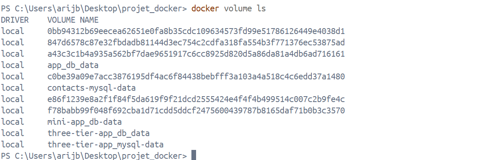
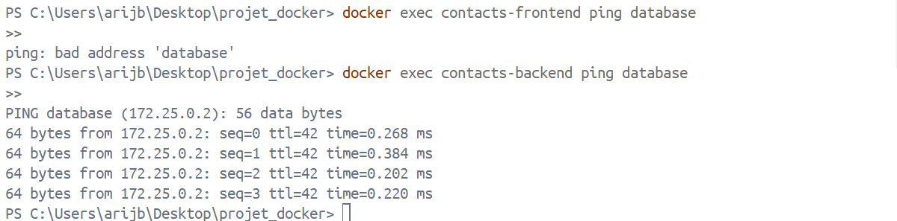
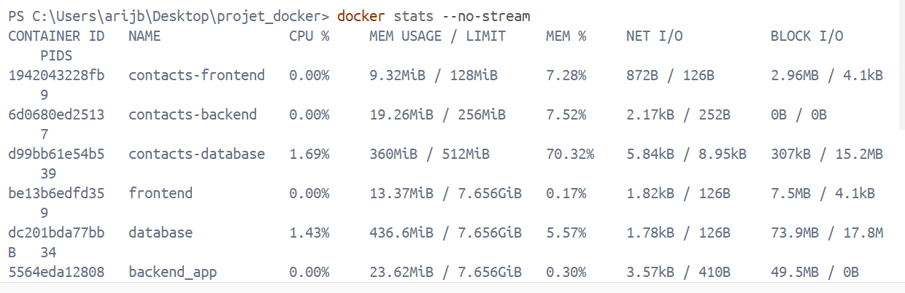
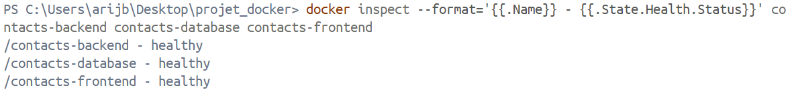
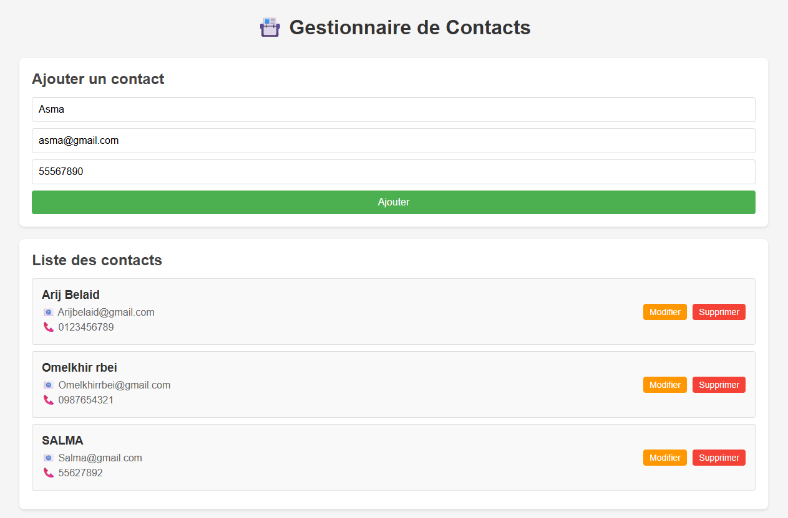
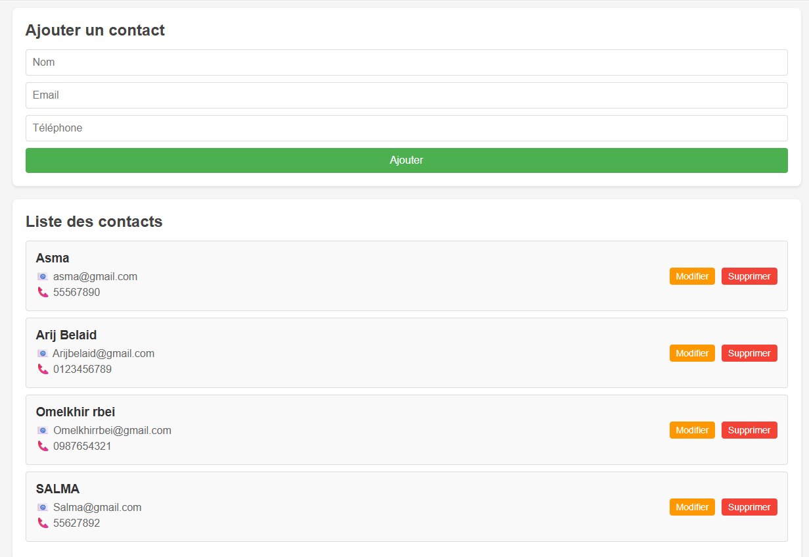
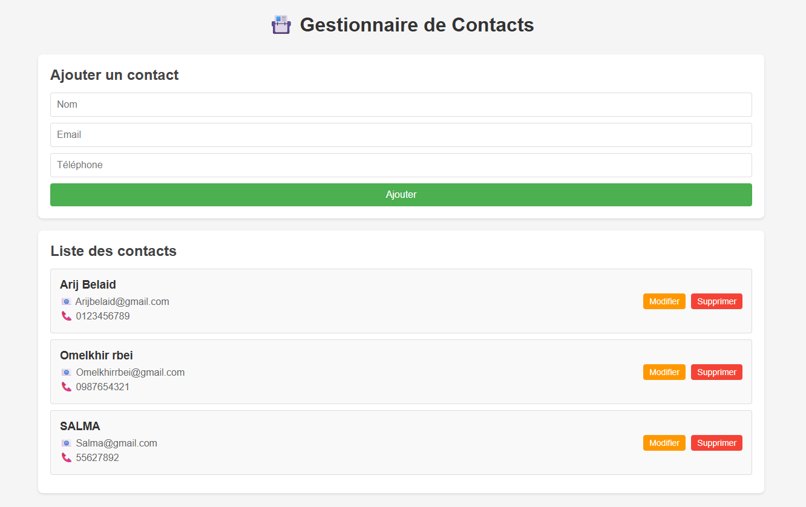
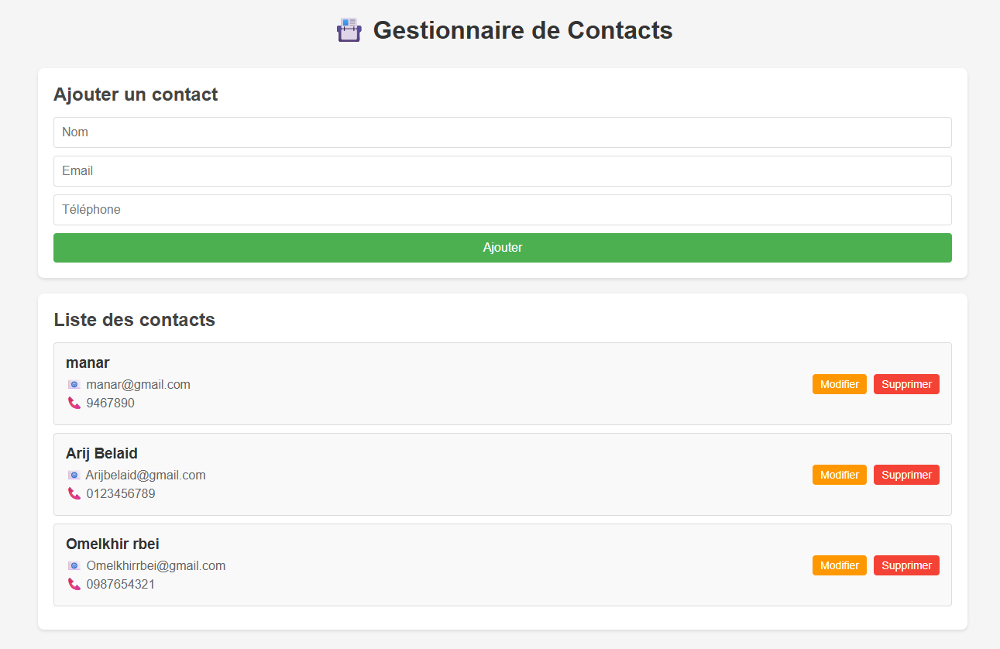
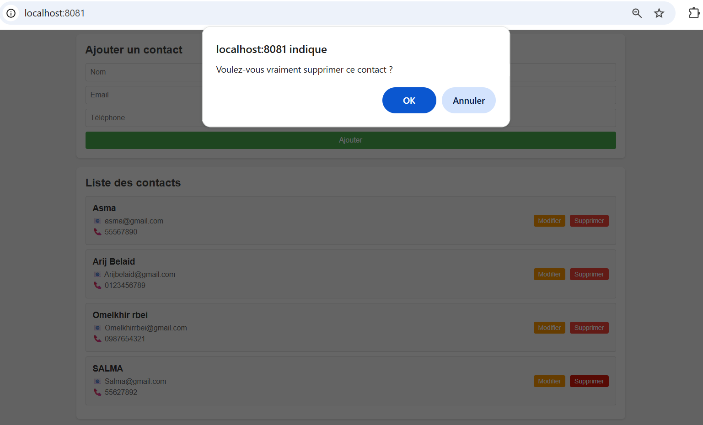
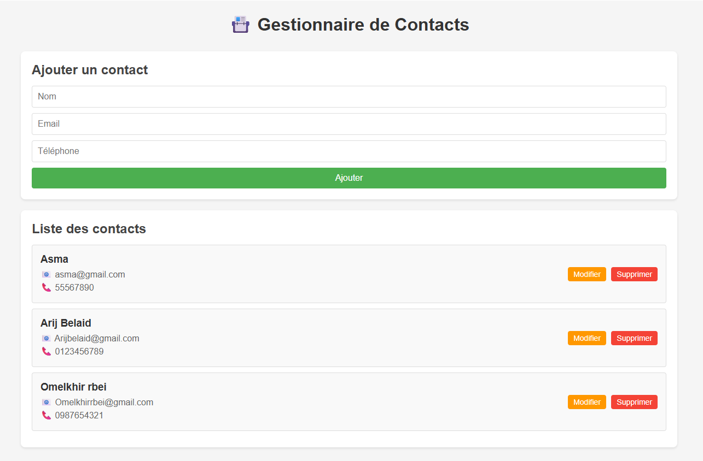

Déploiement d'une Application Multi-Tiers 
----
Description du Projet
---
Application web complète de gestion de contacts suivant une architecture trois-tiers (frontend, backend, base de données) avec orchestration Docker Compose. L'application permet d'effectuer des opérations CRUD (Créer, Lire, Modifier, Supprimer) sur une liste de contacts.

Thématique choisie : Liste de contacts (nom, email, téléphone)

 Lancer l'application
 ---
 docker-compose up -d --build

Tests de Validation - Commandes
---
Test 1 : État des conteneurs
---
docker-compose ps
- 

Test 2 : Réseaux Docker
---
docker network ls | findstr projet
- 

Test 3 : Volumes Docker
---
docker volume ls | findstr contacts
- 

Test 4 : Limites de ressources
---
docker stats --no-stream
- 

Test 5 : Interface frontend
--
Ouvrir dans le navigateur
start http://localhost:8081

Test 6 : Ajout de données
--

curl -X POST http://localhost:3000/api/contacts \
  -H "Content-Type: application/json" \
  -d '{"nom":"Test Lab","email":"test@lab.com","telephone":"0123456789"}'
  
Test 7 : Logs de connexion backend → database
--
docker logs contacts-backend

Test 8 : Isolation réseau
---

Frontend → Database (DOIT ÉCHOUER)

docker exec contacts-frontend ping database

 Backend → Database (DOIT RÉUSSIR)

docker exec contacts-backend ping database -c 2

Test 9 : Health check status
--
- 

docker inspect --format='{{.Name}} - {{.State.Health.Status}}' contacts-backend contacts-database contacts-frontend

Test 10 : Comparaison taille d'image
--
# Backend multi-stage
docker images | findstr backend

# Taille des images Docker
- 
## 🧪 Interface & CRUD

### ➕ Ajouter un contact

- 
- 

---

### 📄 Liste des contacts

- 

---

### ✏️ Modifier un contact

- 

---

### ❌ Supprimer un contact

- 
- 
